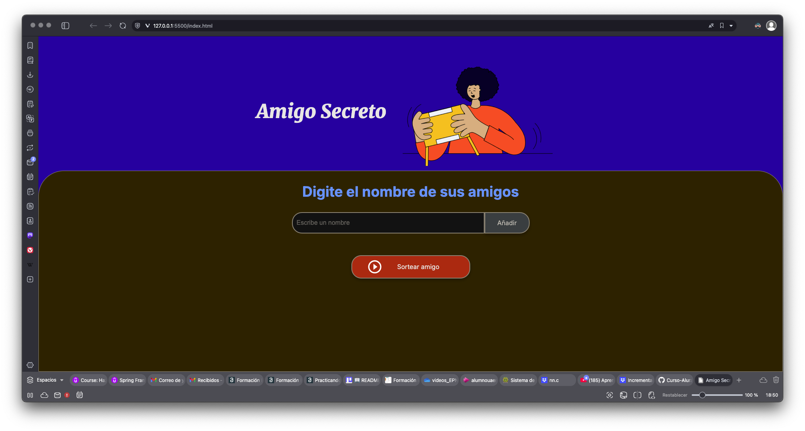

# secretFriend

The following exercise was developed to reinforce the knowledge obtained in the initial AluraLatam course

# About

The game tries to enter a list of friends and when you press the button that says 'Draw friend' it will throw the name of a random friend.

# Images

# Structure

Project: Secret Santa

File Structure:
amigo-secreto/
├── assets/                  # Folder containing static resources
 │   └── amigo-secreto.png    # Representative image of the project
├── index.html               # Main file containing the HTML structure
├── style.css                # CSS file for the project's styling
└── app.js                   # JavaScript file for the project's logic

# Technologies Used

This project is built using the following technologies:

* **HTML** : Used to structure the content of the web page.
* **CSS** : Applied for styling and making the design visually appealing.
* **JavaScript** : Handles the interactive and dynamic behavior of the application.
